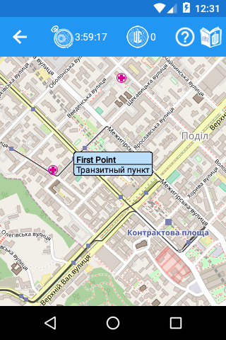

# Doctor Who: Urban Climb Quest

The Doctor has gone missing. Last time his TARDIS was seen getting down over the city of Kiev in 2015, being shot a mysterious sort of weapon. At the same time, anomalies began to emerge all over the city centre threatening locals there. The only hope left for saving Kiev is to find Doctor and, if needed, rescue him. Teams of brave urban climbers stand ready to fulfil their mission of bringing peace to their city.

